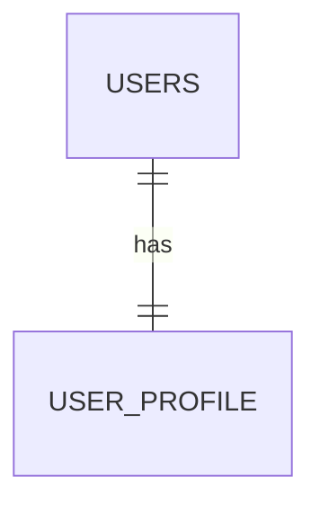
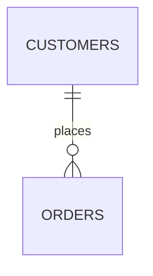
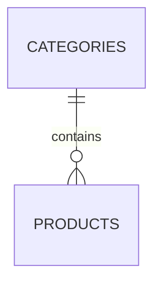
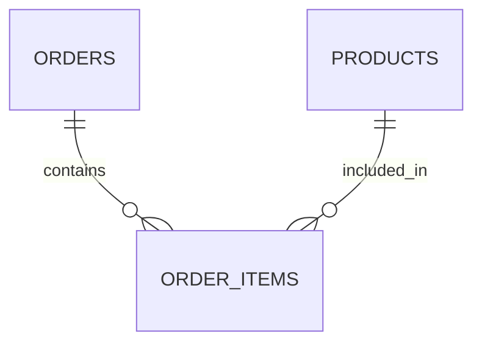

# Database Relationships

## Definition of Database Relationship

A **database relationship** defines how tables in a database are connected to each other using keys. These relationships help organize data efficiently, reduce redundancy, and maintain data integrity. Relationships are usually created using **primary keys** and **foreign keys**.

In an e-commerce application, database relationships are essential to connect users, products, orders, and payments in a structured way.

---

## Types of Database Relationships

### 1. One-to-One (1:1)

**Definition:**
In a one-to-one relationship, one record in a table is associated with only one record in another table.

**E-commerce Example:**

* A **User** and **UserProfile**
* Each user has exactly one profile containing additional details.

**Example Tables:**

* Users (user_id, email, password)
* UserProfile (profile_id, user_id, address, phone)

**Visual Diagram (Conceptual Image):**

```
+---------+        1 : 1        +--------------+
|  USERS  |--------------------| USER_PROFILE |
+---------+        has          +--------------+
```



---

### 2. One-to-Many (1:N)

**Definition:**
In a one-to-many relationship, one record in a table can be related to multiple records in another table.

**E-commerce Example:**

* A **Customer** placing multiple **Orders**
* One customer can place many orders, but each order belongs to one customer.

**Example Tables:**

* Customers (customer_id, name)
* Orders (order_id, customer_id, order_date)

**Visual Diagram:**

```
+-----------+        1 : N        +---------+
| CUSTOMERS |--------------------| ORDERS  |
+-----------+       places       +---------+
```



---

### 3. Many-to-One (N:1)

**Definition:**
Many records in one table are associated with a single record in another table.

**E-commerce Example:**

* Many **Products** belong to one **Category**

**Example Tables:**

* Categories (category_id, category_name)
* Products (product_id, category_id, price)

**Visual Diagram:**

```
+-----------+        N : 1        +------------+
| PRODUCTS  |--------------------| CATEGORIES |
+-----------+      belongs to    +------------+
```



---

### 4. Many-to-Many (M:N)

**Definition:**
In a many-to-many relationship, multiple records in one table relate to multiple records in another table. This relationship is implemented using a **junction table**.

**E-commerce Example:**

* **Orders** and **Products**
* One order can contain many products, and one product can appear in many orders.

**Example Tables:**

* Orders (order_id, customer_id)
* Products (product_id, name)
* Order_Items (order_id, product_id, quantity)

**Visual Diagram:**

```
+--------+        M : N        +----------+
| ORDERS |--------------------| PRODUCTS |
+--------+      via           +----------+
                |
                |
          +-------------+
          | ORDER_ITEMS |
          +-------------+
```



---
